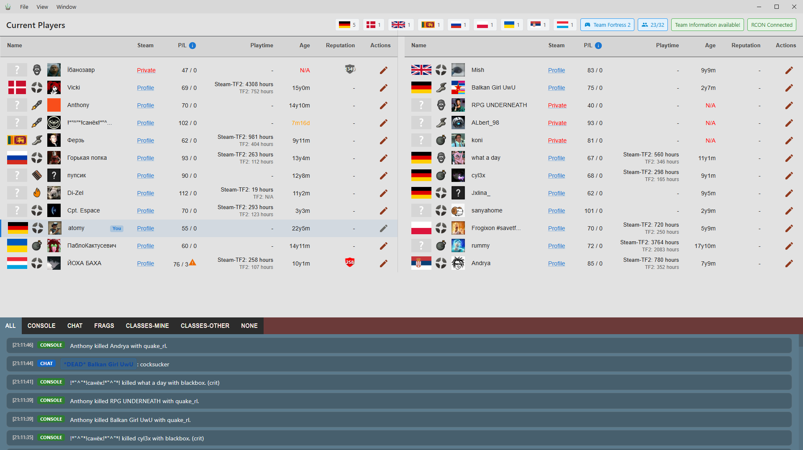
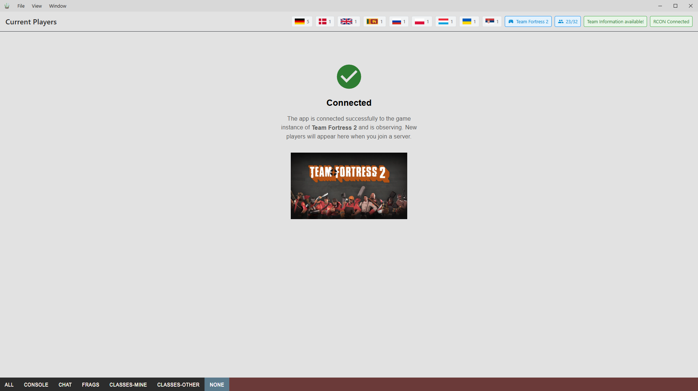
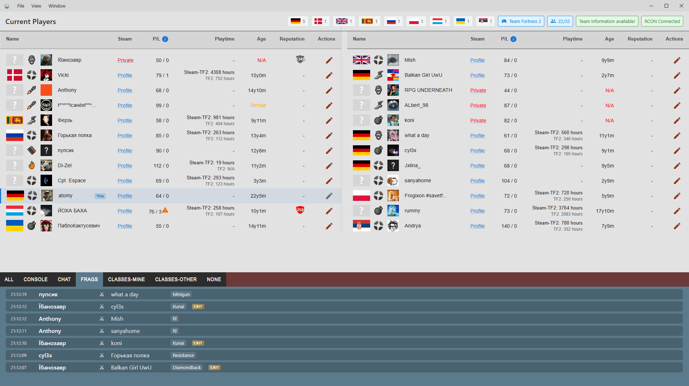
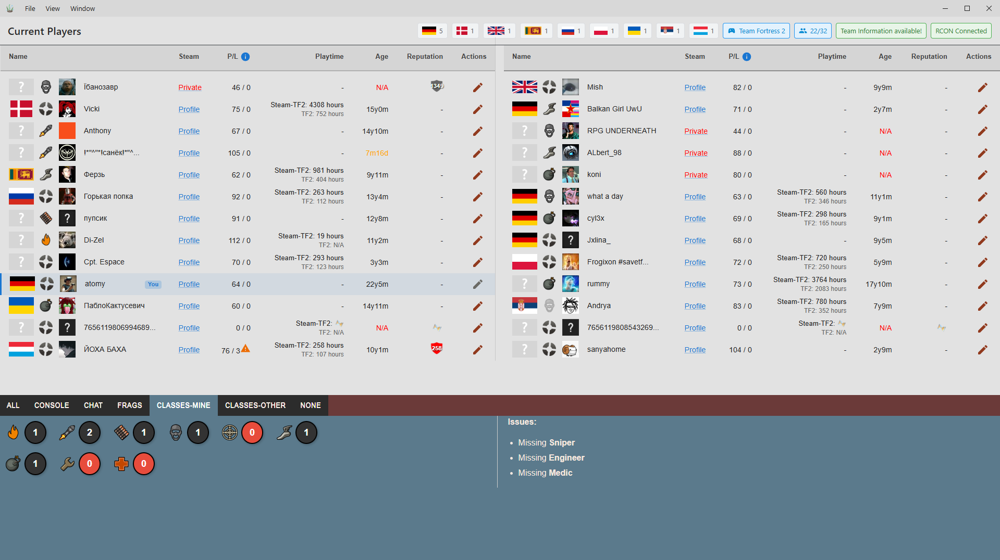
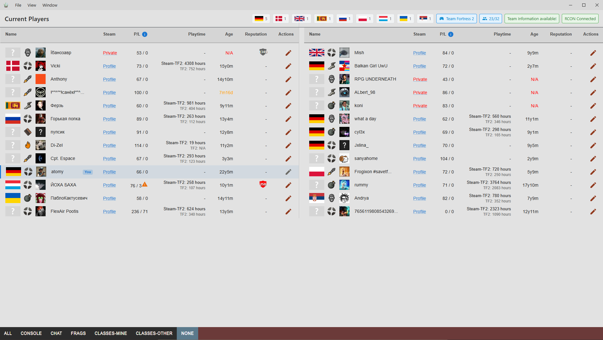

# Overview

Application that connects to your source-1 game instance (Team Fortress 2, mods like Dystopia etc.) and shows all players currently on the server where you are on, providing additional intelligence information.

## Features
- Show all players from current TF2-Session
- Show Team of player
- Display Steam-Avatar of every player
- Provide link to steam-profile of players
- Show connection-stats for player, ping, loss
- Display steam playtime and account age of player
- Player-Reputation-functionality, mark players for good/bad behaviour and display that info next to their name, also detect players having VAC bans
- Reputation system for players, you can mark players as *bots*, *hackers*, *general-warning* or *+reputation* (local database)
- Show country flag of players
- Class balance analysation
- **Real-time game log:** filterable console, chat, and kill feed (frags) with timestamps and weapon/crit info
- **RCON:** Remote Console connection status and server monitoring

### Connection status

When connected, the app shows a clear status and observes your game instance. New players appear as you join a server.

### Kill feed (Frags)

View a live feed of who killed whom, with which weapon, and whether it was a critical hit. Filter the log by **FRAGS**, CONSOLE, CHAT, or class views.

### Class intelligence

Showing class distribution and “issues” in class balance for your team and the other team (e.g. missing Sniper, Engineer, Medic).

### Player list with class icons

Player list with Steam profile links, ping/loss, playtime, account age, reputation, and TF2 class icons per player. Your own row is highlighted.

